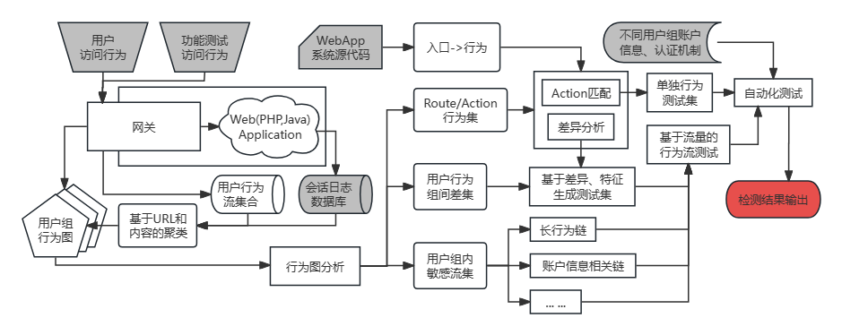
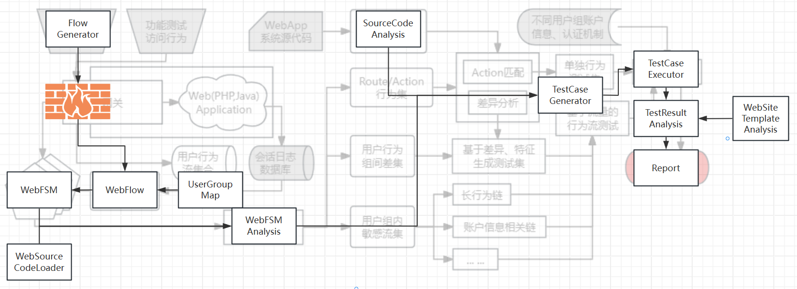

<!--
 * @Author: Suez_kip 287140262@qq.com
 * @Date: 2023-11-24 15:48:26
 * @LastEditTime: 2024-04-11 19:38:17
 * @LastEditors: Suez_kip
 * @Description: 
-->
# BACD

## 流程图分析

  

## 文件结构和流程图对比

  

## TODO List

- WebFSM

  - [ ] UserGroupMap.py
  - [ ] WebFlow.py
  - [ ] WebFSM.py
  - [ ] WebFSMAnalysis.py
  - [ ] SourceCodeAnalysis.py
  - [ ] TestCaseGenerator.py
  - [ ] TestCaseExecutor.py
  - [ ] TestResultAnalysis.py
  - [ ] Report.py

- Tools

  - [ ] FlowGenerator.py
  - [ ] WebSiteTemplateAnalysis.py
  - [ ] WebSourceLoader.py

## 数据库设计

数据库共会维护七张表，其中第一张是唯一的，后面几张可以根据性能扩展：

- meta表，记录有哪些域名等以及其数据库的分布情况，这张表在小数据量中可以省略；
- 请求全数据记录，对应到响应和相应统计；
- 响应全数据记录，对应到请求和接口；
- 请求统计（接口）表，记录请求的相关信息用于重放对应，基于uri（可以包括参数键）hash形成uuid；
- 参数记录表，附属于某个接口的参数组，其中参数组会被对应到全请求数据表；
- 响应统计表，附属于某个请求下的结果，结构一致的会被重新存储；
- 敏感参数，以及通用数据记录表；

## 图分析算法设计

### 针对Web应用的分析

根据我们常见的Web应用内容分析，我们不难发现，一般一个页面会被按照树结构为基础的森林结构。

但是这里的树存在着一些不同点，Web应用树会存在明显的层级，并且分成两类：

- 一种是子森林结构，其子结构具有严格的父子关系，我们命名这里的子树和子森林为子区域；
- 另一种是同一结构下的不同内容，不同层级之间并不会严格按照树的父子关系，而是不同层级之间随机连接；
- 同层级节点之间会有随机的出入度；
- 一些直达边（可以认为是设计者提供的快捷方式）

除此之外，Web应用的子区域中，边缘节点会有向子区域的根节点（或者是子根节点，但这个节点必须是该节点的直系父节点）或公共区域的出度。

### 分析边缘节点

边缘节点考虑没有出度的节点，但是我们要完成一些边的剪枝：

- 同层级内的节点度；
- 返回根节点（或者是子根节点，但这个节点必须是该节点的直系父节点）或公共区域的出度；

其他的边，比如不同层级间的随机边、快捷边，这些都是从高层向低层的有向边，不会影响边缘敏感节点或敏感链的检查；
